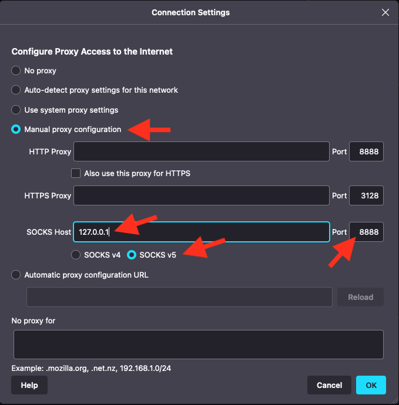

Table of Contents

- [ssh-uuid, scp-uuid](#ssh-uuid-scp-uuid)
- [Usage examples](#usage-examples)
  - [Remote command at the end of the command line, like standard `ssh`](#remote-command-at-the-end-of-the-command-line-like-standard-ssh)
  - [Remote command execution with `--service`](#remote-command-execution-with---service)
  - [Remote command execution preserves the command's exit status code](#remote-command-execution-preserves-the-commands-exit-status-code)
  - [Piping stdin/stdout/stderr works just like standard `ssh`](#piping-stdinstdoutstderr-works-just-like-standard-ssh)
  - [File transfer with `scp`](#file-transfer-with-scp)
  - [File transfer with `cat`](#file-transfer-with-cat)
  - [File transfer with `tar`](#file-transfer-with-tar)
  - [File transfer with `rsync`](#file-transfer-with-rsync)
  - [Port fowarding and SOCKS proxy with ssh's `-D`, `-L` and `-R` options](#port-fowarding-and-socks-proxy-with-sshs--d--l-and--r-options)
    - [Web (http) server running on the device: local port 8000, remote port 80](#web-http-server-running-on-the-device-local-port-8000-remote-port-80)
    - [Local port 80 may be forwarded using `sudo`](#local-port-80-may-be-forwarded-using-sudo)
    - ["Hostvia" - Access a remote device through another remote device](#hostvia---access-a-remote-device-through-another-remote-device)
    - [Expose a local server to a remote device](#expose-a-local-server-to-a-remote-device)
    - [Use the remote device as an Internet point of presence for web browsing](#use-the-remote-device-as-an-internet-point-of-presence-for-web-browsing)
- [Installation](#installation)
  - [Dependencies](#dependencies)
    - [macOS](#macos)
    - [Linux (Debian, Ubuntu, others)](#linux-debian-ubuntu-others)
    - [Windows](#windows)
- [Authentication](#authentication)
  - [More about authentication](#more-about-authentication)
- [Troubleshooting](#troubleshooting)
- [Why?](#why)

# ssh-uuid, scp-uuid

This project is a proof of concept implementation of the "thinnest useful wrapper" around
the standard `ssh` and `scp` tools to allow them to connect to the `ssh` server of a
remote balenaOS device, using the balenaCloud backend as a "raw bytestream pipe" between
the ssh client and the ssh server.

The thin wrapper does a light-touch editing of the `ssh` or `scp` command line options
provided by the user, before passing them to the actual `ssh` or `scp` tools. It
automatically adds a `'-o ProxyCommand=…'` option that tunnels the connection through the
balenaCloud backend. It also adds a `--service` command line option that allows specifying
the name of a balena fleet service (application container running in balenaOS) in order to
target a service instead of the host OS.

With this approach, all standard `ssh` and `scp` command line options, standard
environment variables and standard configuration files are supported, plus remote command
execution as provided by standard `ssh` -- preserving the remote command exit status code
and allowing the plumbing of stdin/stdout/stderr.

This project is also an alternative vision of what the `balena ssh` command could be.
For more background information, check the **[Why](#why)** section.

# Usage examples

The device's ssh/scp hostname has the format `'<device-UUID>.balena'`, using the device's
full UUID (not a shortened form).

The `--service` option is used to target a balena fleet service name. When `--service` is
used, behind the scenes a `balena-engine exec` command takes care of executing the remote
command in the service container (similar to `balena ssh`), but the command syntax and
argument escaping are identical to standard `ssh`.

## Remote command at the end of the command line, like standard `ssh`

```sh
$ ssh-uuid a123456abcdef123456abcdef1234567.balena cat /etc/issue
balenaOS 2.85.2 \n \l
```

## Remote command execution with `--service`

```sh
$ ssh-uuid --service my-service a123456abcdef123456abcdef1234567.balena cat /etc/issue
Debian GNU/Linux 11 \n \l
```

## Remote command execution preserves the command's exit status code

```sh
$ ssh-uuid --service my-service a123456abcdef123456abcdef1234567.balena true; echo $?
0
$ ssh-uuid --service my-service a123456abcdef123456abcdef1234567.balena false; echo $?
1
```

## Piping stdin/stdout/stderr works just like standard `ssh`

... because it ***is*** standard `ssh`!

```sh
$ cat local.txt | ssh-uuid --service my-service a123456abcdef123456abcdef1234567.balena cat '>' /tmp/local-copy.txt

$ ssh-uuid --service my-service a123456abcdef123456abcdef1234567.balena cat /tmp/remote.txt > remote-copy.txt
```

Note how `'>'` was quoted in the first command line above, so that the stdout redirection
is interpreted by the remote shell rather than the local shell (standard `ssh` syntax). In
the second command line, `'>'` is not quoted because we actually want the local shell to
interpret it as stdout redirection.

## File transfer with `scp`

```sh
# local -> remote
$ scp-uuid local.txt a123456abcdef123456abcdef1234567.balena:/mnt/data/
local.txt                   100%    6     0.0KB/s   00:00

# remote -> local
$ scp-uuid a123456abcdef123456abcdef1234567.balena:/tmp/remote.txt .
remote.txt                  100%   17     0.0KB/s   00:01
```

All `scp` command line options are supported. The `-r` option is used to copy a whole
folder:

```sh
# local -> remote
$ scp-uuid -r local-folder a123456abcdef123456abcdef1234567.balena:/mnt/data/
local.txt                   100%    6     0.0KB/s   00:00

# remote -> local
$ scp-uuid -r a123456abcdef123456abcdef1234567.balena:/mnt/data/remote-folder .
remote.txt                  100%   17     0.0KB/s   00:01
```

To copy files or folders to a service container, check the following sections for file
copy with `cat`, `tar` or `rsync`. When the `--service` option is used with `scp-uuid`,
help output is printed with some great or even superior alternatives using `tar` or
`rsync`.

If you are transferring files to/from a service's named volume (often at the '/data' mount
point in service containers), note that named volumes are also exposed on the host OS
under folder `'/mnt/data/docker/volumes/<fleet-id>_data/_data/'`. As such, it is also
possible to scp to/from named volumes without using `--service`:

```sh
# local -> remote
$ scp-uuid -r local-folder UUID.balena:/mnt/data/docker/volumes/<fleet-id>_data/_data/

# remote -> local
$ scp-uuid -r UUID.balena:/mnt/data/docker/volumes/<fleet-id>_data/_data/remote-folder .
```

## File transfer with `cat`

```sh
# local -> remote
$ cat local.txt | ssh-uuid --service my-service UUID.balena cat \> /data/remote.txt

# remote -> local
$ ssh-uuid --service my-service UUID.balena cat /data/remote.txt > local.txt
```

## File transfer with `tar`

```sh
# local -> remote
$ tar cz local-folder | ssh-uuid --service my-service UUID.balena tar xzvC /data/

# remote -> local
$ ssh-uuid --service my-service UUID.balena tar czC /data remote-folder | tar xvz
```

`tar` must be installed both on the local workstation and on the remote service container:

```sh
$ apt-get install -y tar  # Debian, Ubuntu, etc
$ apk add tar  # Alpine
```

## File transfer with `rsync`

```sh
# local -> remote
$ rsync -av -e 'ssh-uuid --service my-service' local-folder UUID.balena:/data/

# remote -> local
$ rsync -av -e 'ssh-uuid --service my-service' UUID.balena:/data/remote-folder .
```

`rsync` must be installed both on the local workstation and on the remote service
container:

```sh
$ apt-get install -y rsync  # Debian, Ubuntu, etc
$ apk add rsync  # Alpine
```

## Port fowarding and SOCKS proxy with ssh's `-D`, `-L` and `-R` options

The wrapper does not interfere, and the full power of standard ssh is made available. This
is a full replacement for the `balena tunnel` command, with additional capabilities such a
dynamic port forwarding (SOCKS proxy) and the benefit of the full range of ssh
configuration options and files.

The `--service` option does not apply because port forwarding terminates in the scope of
the `ssh` server, which is the host OS. To access service container ports, expose them to
the host OS through the `docker-compose.yml` file.

### Web (http) server running on the device: local port 8000, remote port 80

```sh
$ ssh-uuid -NL 8000:127.0.0.1:80 a123456abcdef123456abcdef1234567.balena
```

Point the web browser at http://127.0.0.1:8000

### Local port 80 may be forwarded using `sudo`

Any port numbers lower than 1024 normally require administrator privileges (`sudo`).

```sh
$ sudo ssh-uuid -NL 80:127.0.0.1:80 a123456abcdef123456abcdef1234567.balena
```

Point the web browser at http://127.0.0.1

### "Hostvia" - Access a remote device through another remote device

This is a rudimentary replacement for the balena-proxy "hostvia" functionality. It may be
useful as a diagnostics operation if one of the remote devices gets in trouble and loses
access to balena's VPN service, but can still access its local network. Both remote
devices should be on the same local network, e.g. connected to the same WiFi access point.
For example, assuming two devices on the `192.168.1.xxx` subnet, run both the following
commands on two command prompt windows on your workstation:

* `ssh-uuid -NL 22222:192.168.1.86:22222 2eb94bd6ea9a3b9b4c0442aebf7bdb18.balena`  
  where the UUID is for the good/online/gateway device, and `192.168.1.86` is the IP
  address of the device in trouble (reportedly offline).
* `ssh -p 22222 username@127.0.0.1`  
  where the username is your balenaCloud account username ('root' may also work if the
  second device is running a development image of balenaOS).

### Expose a local server to a remote device

Use the `-R` option to expose a server running on your workstation or on the workstation's
local network to a remote device. For example, a local netcat chat server may be setup as
follows:

* Run a netcat _server_ on your workstation (syntax may vary, check the `nc` manual page):  
  `$ nc -l 1300`
* Forward remote port 1300 to local port 1300:  
  `ssh-uuid -tR 1300:127.0.0.1:1300 2eb94bd6ea9a3b9b4c0442aebf7bdb18.balena`
* Run a netcat client on the remote device, balenaOS host OS prompt:  
  `$ nc 127.0.0.1 1300`
* Type words and hit Enter on each shell (local and remote).

### Use the remote device as an Internet point of presence for web browsing

Use the `-D` option to run a SOCKS proxy server on the local workstation (standard `ssh`
functionality - dynamic port forwarding) and then configure the Firefox web browser (on
the workstation) to use it, thus using the remote device as an Internet "point of
presence". For example, if you are in Europe and the device is in the USA and you open
'whatsmyip.com' on the Firefox browser, you will be reported as being in the USA.

```sh
$ ssh-uuid -vND 8888 a123456abcdef123456abcdef1234567.balena
```

Configure Firefox (Network Settings, Connection Settings) as per screenshot
below.

> NOTE: This screenshot is just an advanced usage example for the `-D` option, which you
> do not have to use! You do not need to use Firefox or change any proxy settings in order
> to use the `ssh-uuid` or `scp-uuid` tools.



# Installation

Clone this repo and create a couple of soft links as follows:

```sh
$ git clone https://github.com/pdcastro/ssh-uuid.git
$ cd ssh-uuid
$ sudo ln -sf "${PWD}/ssh-uuid.sh" /usr/local/bin/ssh-uuid
$ sudo ln -sf "${PWD}/ssh-uuid.sh" /usr/local/bin/scp-uuid
$ which scp-uuid ssh-uuid
/usr/local/bin/scp-uuid
/usr/local/bin/ssh-uuid
```

The soft links (`ln -s`) are important. Both `ssh-uuid` and `scp-uuid` are soft links
to the same `ssh-uuid.sh` script. The script inspects how it was invoked at runtime
in order to decide what functionality to provide.

You will also need to install the dependencies below.

## Dependencies

Follow the steps in your system-specific section below to install:

* `bash` v4.4 or later
* `socat` v1.7.4 or later
* `jq`, `sed`, `ssh`, `scp`

The balena CLI is not strictly required, but it can make authentication easier.
See [Authentication](#authentication) section.

### macOS

Install Homebrew (https://brew.sh/), and then:

```sh
brew update && brew install bash git jq socat ssh
```

### Linux (Debian, Ubuntu, others)

At the time of this writing, the latest stable distros of Debian and Ubuntu provide an
outdated version of `socat` with `apt-get install` (they provide socat v1.7.3, but we need
socat v1.7.4 or later). Here's how to install `socat` v1.7.4 (tested with Debian 9, Debian
10 and Ubuntu 20.04):

```sh
$ sudo apt-get update
$ sudo apt-get install -y curl git jq ssh build-essential libreadline-dev libssl-dev libwrap0-dev
$ curl -LO http://www.dest-unreach.org/socat/download/socat-1.7.4.2.tar.gz
$ tar xzf socat-1.7.4.2.tar.gz
$ cd socat-1.7.4.2
$ ./configure
$ make
$ sudo make install
$ which socat
/usr/local/bin/socat
```

If needed, more details about the compilation of socat can be found at:  
http://www.dest-unreach.org/socat/doc/README

### Windows

Native PowerShell or cmd.exe are not supported by this proof-of-concept implemntation,
but you can use Microsoft's [WSL - Windows Subsystem for
Linux](https://docs.microsoft.com/en-us/windows/wsl/install) (e.g. Ubuntu), and then
follow the instructions for Linux.

# Authentication

Like `balena ssh`, authentication involves ***both*** ssh public key authentication (for
the ssh server) and balenaCloud authentication (balenaCloud username and session token or
API key). See [SSH Access
documentation](https://www.balena.io/docs/learn/manage/ssh-access/).

Using the balena CLI is ***NOT*** a requirement for using `ssh-uuid` or `scp-uuid`.
However, if you happen to have the balena CLI installed, then all you need to do for
authentication is to log in with the balena CLI by running the following commands:

* `balena login`
* `balena whoami`

Running ***both*** commands will ensure that file `~/.balena/cachedUsername` exists and
contains a valid (not expired) session token. The file stores both a balenaCloud username
is the respective session token. The `ssh-uuid` or `scp-uuid` commands will check whether
that file exists (optional), to use the details in there for convenience.

> Note: The `ssh-uuid` or `scp-uuid` script does not check whether a session token has
> expired. Expired tokens will cause authentication errors. If the `'balena whoami'`
> command succeeds, the token is good.

**Alternatively,** if you would rather not use the balena CLI for balenaCloud
authentication, perhaps for non-interactive use, you can set the following two environment
variables instead:

* `BALENA_USERNAME`: your balenaCloud username
* `BALENA_TOKEN`: your balenaCloud session token or API key

Both the username and the session token (or API key) can be found in the balenaCloud
web dashboard, Preferences page.

The authentication instructions above should be sufficient to get you started. The
following section gets into more details, in case you are interested or for
troubleshooting.

## More about authentication

Two levels of authentication are involved:

* balenaCloud username and session token (or API key): These are sent to the balenaCloud
  proxy backend (over HTTPS), which uses the details to ensure that the tunneling
  service is only provided to registered users, and for activity logging.

* SSH username and keys: Used by the balenaOS ssh server (on the device) to authenticate
  the user against their public ssh key. The username may be `'root'` or a balenaCloud
  username, with different behaviors depending on whether the remote device is running a
  [development or production
  image](https://www.balena.io/docs/reference/OS/overview/2.x/#development-vs-production-images)
  of balenaOS, as per table below.

Username | Production Image | Development Image
-------- | ---------------- | -----------------
root | Requires adding a ssh public key to the [sshKeys section of config.json](https://www.balena.io/docs/reference/OS/configuration/#sshkeys) | ⚠ Allows unauthenticated access
balenaCloud username | ssh server authenticates against user's public SSH key stored in balenaCloud (requires balenaOS v2.44.0 or later) | ssh server authenticates against user's public SSH key stored in balenaCloud (requires balenaOS v2.44.0 or later)

Reminder: public key authentication involves a pair of private and public keys:

* Both the private and public keys are stored in the user's workstation, typically in the
  `~/.ssh/` folder in the user's home directory on the machine where `ssh` (or `ssh-uuid`)
  is executed.
* A copy of the public key is additionally stored remotely, either on the machine where
  the ssh server is running (e.g. the `config.json` file of a balenaOS device), or in the
  cloud (balenaCloud dashboard / API datatabase).

# Troubleshooting

* Set the DEBUG=1 environment variable to enable some debugging output produced by
  the `ssh-uuid.sh` script itself.
* Add the `-v`, `-vv` or `-vvv` command line option, e.g.:  
  `DEBUG=1 ssh-uuid -v a123456abcdef123456abcdef1234567.balena cat /etc/issue`

Common errors:

* `socat[1355] E parseopts(): unknown option "proxy-authorization-file"`  
  This error means that your system is using an outdate version of 'socat'.
  Update `socat` to version 1.7.4 or later as per Dependencies section.

* `socat[25336] E CONNECT a123456abcdef123456abcdef1234567.balena:22222: Proxy Authorization Required`  
  Double check that the authentication session or API token is correct and has not expired.
  See [Authentication](#authentication) section.

* `socat[25072] E CONNECT a123456abcdef123456abcdef1234567.balena:22222: Internal Server Error`  
  Double check that the UUID is correct. Ensure you're using the full long UUID, not the
  7-char short form.

# Why?

Why are `ssh-uuid` and `scp-uuid` needed? What's wrong with the existing `balena ssh` and
`balena tunnel` implementations?

Currently, `balena ssh` does not aim at command line compatibility with `ssh` or `scp` and
offers only a small subset of the "Swiss army knife" functionality provided by standard
`ssh` and `scp`. The [manual page of ssh](https://linux.die.net/man/1/ssh) lists more than
40 command line options and tens of further [configuration
options](https://linux.die.net/man/5/ssh_config), most of which consist of functionality
not matched by `balena ssh`.

The most commonly reported issues/requests are probably the lack of file copy
functionality (no `balena scp` command exists), and the limited support for running remote
commands with `balena ssh` _while preserving command exit code and allowing plumbing of
stdin / stdout / stderr,_ as in the [Usage Examples](#usage-examples) section.

`balena ssh` and the balenaCloud proxy service offer their own "custom interface"
(incompatible with standard ssh) for remote command execution:

```sh
$ echo "uptime; exit;" | balena ssh 8dc8a1b
```

This custom interface takes a command line via stdin. It is problematic because:

* It does not allow plumbing stdin/stderr/stdout, as stdin is used to specify the remote
  commands.
* It does not preserve the remote command exit code (not event explicit exit codes such as
  `exit 3`).
* Unlike standard `ssh`, it requires explicitly running `exit` in order to end the remote
  session, which is prone to "hanging session" bugs.
* Being named `balena ssh`, it suggests the provision of `ssh`'s functionality, while
  being incompatible with basic `ssh` command line usage.

These limitations are fundamentally related to how the balenaCloud proxy currently sits as
a "man in the middle" ssh server that provides its own API to clients and makes its own
connections to the ssh server on devices.

The `balena tunnel` command was created in part to work around these limitations, by
tunneling a TCP connection (raw bytestream) between a standard `ssh` client and the `ssh`
server on a balenaOS device. However, to that end, `balena tunnel` adds complexity and a
point of failure by requiring users to explicity run two different processes in different
shell prompts: `balena tunnel` in a prompt, and standard `ssh` in another. It also falls
on the user to choose a free TCP port number to provide as argument to both processes.
Also, `balena tunnel` offers only a small subset of features/options of standard `ssh`,
and indeed `balena tunnel` could be completely replaced with the standard port forwarding
options of standard `ssh` (`-L`, `-R` and `-D` options).

While `balena ssh` offers a custom, incompatible interface to `ssh` functionality, it
still uses the standard `ssh` tool behind the scenes, and having the `ssh` tool
pre-installed is already a requirement of the balena CLI. In the past, there was
discussion about removing the need of pre-installing `ssh` by using a Javascript
implementation of `ssh` such as the `ssh2` npm module, but the motivation for that effort
was weakened when Microsoft Windows 10 started shipping with the `ssh` tool pre-installed.
Nowadays, Apple, Microsoft and all Linux distributions offer a standard `ssh` tool in
their operating systems.

The `ssh-uuid` implementation provided in this project is able to replace both the `balena
ssh` and the `balena tunnel` commands (and potentially, eventually, part of the
balena-proxy backend) with a single revamped `balena ssh` command implemented as a thin
wrapper around `ssh`. To end users, it offers a lot more functionality, full compatibility
with the `ssh` and `scp` command lines that many users are familiar with, and removes the
complexity of managing separate processes (`balena tunnel` + `ssh`) in common usage
scenarios. To balena developers, `ssh-uuid` promises fewer lines of code and a simpler
architecture by minimally wrapping the standard `ssh` tool and avoiding the "man in the
middle" backend ssh server that terminates and initiates `ssh` sessions on behalf of the
balena CLI.
